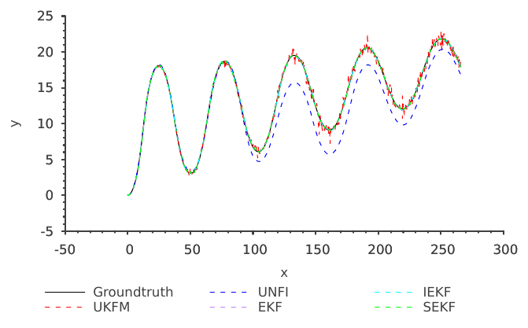

# Running a demo

- [Running a demo](#running-a-demo)
  - [The demo plots](#the-demo-plots)
  - [The demo options](#the-demo-options)
  - [The demo metrics](#the-demo-metrics)
    - [The Root Mean Square Error](#the-root-mean-square-error)
    - [The Absolute Translation Error](#the-absolute-translation-error)
    - [The Absolute Orientation Error](#the-absolute-orientation-error)
    - [The Final Pose Error](#the-final-pose-error)
    - [The Relative Errors](#the-relative-errors)

After following the [setup guide](../CONTRIBUTING.md),
we can run one of the provided demo.
As an example,
we will showcase the demo [`examples/demo_se2`](../examples/demo_se2.cpp).

> :heavy_exclamation_mark: Pro tip, if you only want to run the example,
> or to deploy your application,
> don't forget to compile in `Release` together with the appropriate optimization flags :heavy_exclamation_mark:

Without further due, let's run it:

```bash
$ cd build/examples
$ ./demo_se2

X simulated      : +0.00000 +0.00000 +0.00000
X estimated EKF  : +0.44013 -3.07954 +2.97186 : |d|=+5.22889
X estimated SEKF : +0.44013 -3.07954 +2.97186 : |d|=+5.22889
X estimated IEKF : +0.07242 -0.04252 +0.14026 : |d|=+0.21540
X estimated UKFM : +0.21577 +2.77866 -2.35481 : |d|=+4.34255
X unfilterd      : -0.00125 +0.00084 -0.00118 : |d|=+0.00225
----------------------------------
...
----------------------------------
X simulated      : +259.57122  +66.78571   -0.36915
X estimated EKF  : +259.63376  +66.43129   -0.36668 : |d|=+0.02875
X estimated SEKF : +259.63376  +66.43129   -0.36668 : |d|=+0.02875
X estimated IEKF : +259.62728  +66.45183   -0.36651 : |d|=+0.01739
X estimated UKFM : +259.51942  +66.77590   -0.36393 : |d|=+0.69864
X unfilterd      : +258.65849  +62.90753   -0.25352 : |d|=+11.90319
----------------------------------
      RMSE      RRMSE     ATE       RTE       AOE       ROE       FPE
EKF   +0.11785  +1.10971  +0.10668  +1.06239  +0.00335  +0.04341  +0.02875
IEKF  +0.07645  +0.46241  +0.07484  +0.45011  +0.00223  +0.01591  +0.01739
SEKF  +0.11785  +1.10971  +0.10668  +1.06239  +0.00335  +0.04341  +0.02875
UKFM  +0.37889  +1.20746  +0.37708  +1.18011  +0.00361  +0.03695  +0.69864
UNFI  +4.80459  +0.09614  +4.80363  +0.09013  +0.05659  +0.01835  +11.90319
```

We see that a bunch of info got printed on the terminal.
At each iteration, we print the simulated (true) pose,
then the estimated pose by each filter,
and last the unfiltered pose.
For each estimated/unfiltered pose,
we compute its distance to the ground-truth.
Upon finishing, we calculate all kind of metrics,
comparing the estimated pose to the ground truth for each filter.
The metrics are [summarized below](#the-demo-metrics).

## The demo plots

In case you compiled with the flag enabling plots,
running e.g.

```bash
./demo_se2 --plot-trajectory
```

will open a window with the trajectories (simulated/estimated/unfiltered) plotted such as the one below.



## The demo options

```bash
$ ./demo_se2 -h
Usage: ./demo_se2 <option(s)>
E.g. ./demo_se2 -f demo_plots -n
Options:
  -h, --help               Show this helper
  -t, --plot-trajectory    Plot the trajectories
  -e, --plot-error         Plot the errors
  -f, --filename FILENAME  Base filename to save plots
```

This tells us what are the different options of the demo.

## The demo metrics

### The Root Mean Square Error

![\tau][latex1]

![RMSE][latex2]

### The Absolute Translation Error

![\gamma][latex3]

![ATE][latex4]

### The Absolute Orientation Error

![\gamma][latex5]

![AOE][latex6]

with,

![\gamma][latex7]

![AOE][latex8]

### The Final Pose Error

![FPE][latex9]

### The Relative Errors

The remaining metrics are:

- the Relative Root Mean Square Error
- the Relative Translation Error
- the Relative Orientation Error

and are local application of the previous metrics on aligned trajcetory segments.
To compute the relative metrics,
the trajectory is sliced into temporal blocks of $\Delta$ seconds, ![\bfS][latex10].
The initial pose of each block is then aligned to the initial pose of the block,
![\gamma][latex11].

The previous metrics are then applied to each block and summed up,

![RRMSE][latex12]

![RTE][latex13]

![ROE][latex14]

[//]: # (URLs)

[latex0]: https://latex.codecogs.com/svg.latex?\mathbf&amp;space;\mathcal{X}^{-1}
[latex1]: https://latex.codecogs.com/svg.latex?\tau=\hat{\chi}_{k}\ominus{\chi}_{k}
[latex2]: https://latex.codecogs.com/svg.latex?{\bf&amp;space;RMSE}=(\frac{1}{n}\sum_{k=1}^{n}\left\|\tau_k\right\|^2)^{\frac{1}{2}}
[latex3]: https://latex.codecogs.com/svg.latex?\gamma_k=\chi_k^{-1}\hat{\chi}_k
[latex4]: https://latex.codecogs.com/svg.latex?{\bf&amp;space;ATE}=(\frac{1}{n}\sum_{k=1}^{n}\left\|trans(\gamma_k)\right\|^2)^{\frac{1}{2}}
[latex5]: https://latex.codecogs.com/svg.latex?\gamma_k=\chi_k^{-1}\hat{\chi}_k
[latex6]: https://latex.codecogs.com/svg.latex?{\bf&amp;space;AOE}=\frac{1}{n}\sum_{k=1}^{n}\angle(rot(\gamma_k))
[latex7]: https://latex.codecogs.com/svg.latex?\angle(rot(\gamma_k))=\left\|\theta\right\|,\text{for}~\gamma_k\in\textrm{SE}(2)
[latex8]: https://latex.codecogs.com/svg.latex?\angle(rot(\gamma_k))=\text{angular-distance}({\bf&amp;space;q},{\bf&amp;space;qi}),\text{for}~\gamma_k\in\textrm{SE}(3),~\text{with}~{\bf&amp;space;qi}~\text{the&amp;space;quaternion&amp;space;identity}
[latex9]: https://latex.codecogs.com/svg.latex?{\bf&amp;space;FPE}=\left\|\hat{\chi}_K\ominus\chi_{K}\right\|
[latex10]: https://latex.codecogs.com/svg.latex?{\bf&amp;space;S}\{\gamma\}_{l}=\{\gamma_k,...,\gamma_{k+\Delta}}
[latex11]: https://latex.codecogs.com/svg.latex?\gamma_{k+\Delta}=(\chi_k^{-1}\chi_{k+\Delta})^{-1}(\hat{\chi}_k^{-1}\hat{\chi}_{k+\Delta})
[latex12]: https://latex.codecogs.com/svg.latex?{\bf&amp;space;RRMSE}=\sum_{l=1}^{n}{\bf&amp;space;RMSE}({\bf&amp;space;S}\{\gamma\}_{l})
[latex13]: https://latex.codecogs.com/svg.latex?{\bf&amp;space;RTE}=\sum_{l=1}^{n}{\bf&amp;space;ATE}({\bf&amp;space;S}\{\gamma\}_{l})
[latex14]: https://latex.codecogs.com/svg.latex?{\bf&amp;space;ROE}=\sum_{l=1}^{n}{\bf&amp;space;AOE}({\bf&amp;space;S}\{\gamma\}_{l})
